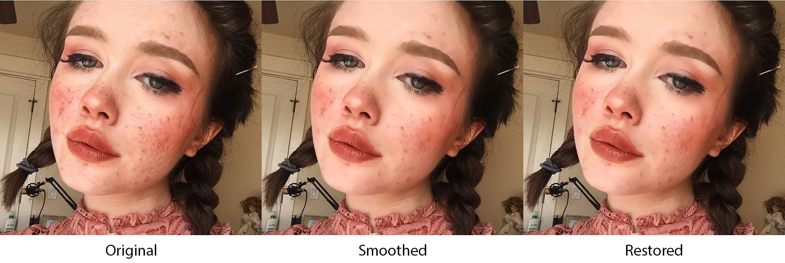
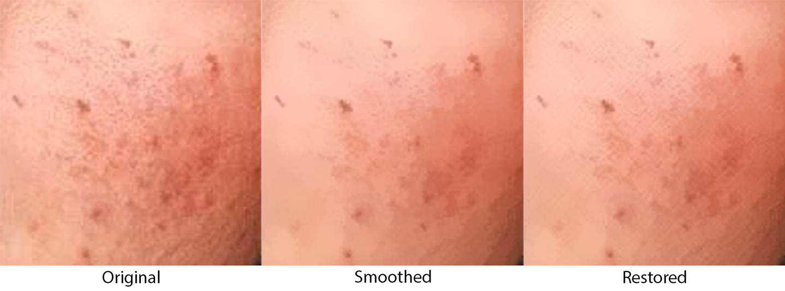
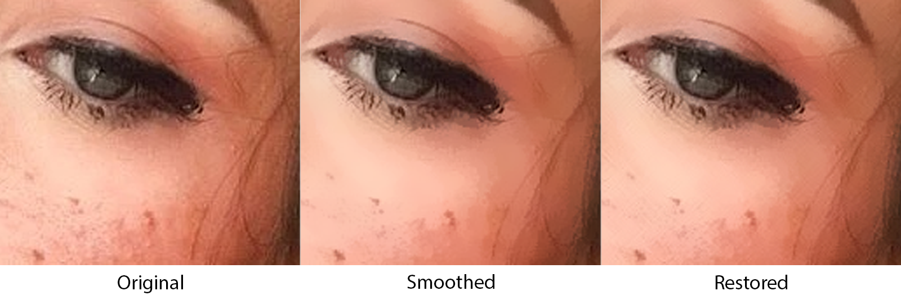
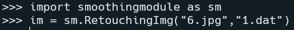
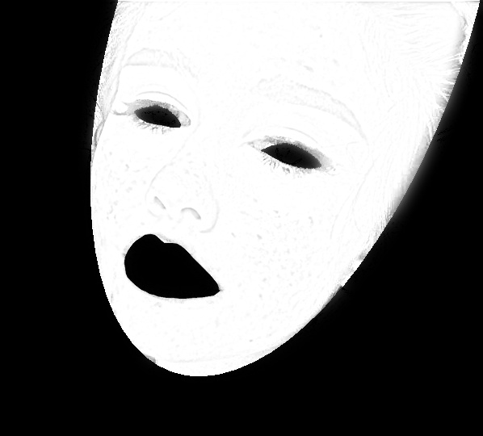

# Retouching Algorithm
This project is an unofficial implementation of [FabSoften: face beautification via dynamic skin smoothing, guided feathering, and texture restoration](https://openaccess.thecvf.com/content_CVPRW_2020/papers/w31/Velusamy_FabSoften_Face_Beautification_via_Dynamic_Skin_Smoothing_Guided_Feathering_and_CVPRW_2020_paper.pdf). Also this project is a python module written in C++.

  
## Skin
  
## Eye and hair


# Requirements

* Make sure that you have all libs in /external   
* Also you should install OpenCV

# Building

```
mkdir build
cd build
cmake ..
```
# Compiling

Only Release

# After Compiling

Put necessary dll's into the Release folder  
All necessary dll's you can find in assets or you can manually add it via building and compiling OpenCV

# Example of work in python



# Implementations 

- [x] Preprocessing
  - [x] Landmark Detection
  - [x] Binary Skin Mask
  - [x] Blemish Detection and Concealment
- [x] Skin Mask Generation and Refinement
  - [ ] GMM Clustering
  - [ ] Segmentation
  - [x] Guided Feathering
- [x] Skin Imperfection Smoothing
  - [ ] Dynamic Smoothing Hyperparameter
- [x] Skin Texture Restoration (DWT)

# Conclusion

In Fabsoften paper they used GMM Clustering and Segmentation via CNN to create probability mask, but with Guided Filter and DoG we can also create probability mask  



# Functions

| Name of the function | Discription | Input |
|:---------:|:---------:|:---------:|
| Retouching | Retouching array-like data | Array-like data and Model Dir |
| RetouchingImg | Retouching photo (jpg, png, e.t.c.) | Photo Dir and Model Dir |